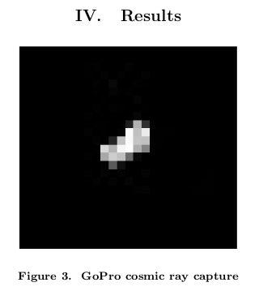

# CMOS Cosmic Event Image Capture (CCEIC? Psych?)

Currently in testing, it just looks for peaks in brightness, above the average brightness * a threshold multiplier.

The paper (see references below) says it's possible. This is the idea, from them:


They get results like this:


I'm using my worst camera currently, and get mostly noise. Even the bright specks in the image are likely noise.  I'll update when I switch to a higher quality camera.


## Dependencies
- Python3
- numpy, and matplotlib and PIL for image display
- Also: pip3 install pyv4l2 (and maybe also v4l2)

## Run
- Run v4l2-ctl --list-formats-ext to see your cam's resolutions
- Set resolution: You'll need to set your resolution in muon-camera.py by hand for now. Sorry. It loads a single raw string of data (width*height*channels) with pyv4l2, and relies on your resolution to make it into the proper-shaped array. It does NOT set this resolution, so you need to make sure you got it right.
- Set your video device, also, in muon-camera.py
- Cover your camera so it doesn't receive visible light. (Alternatively, point it at normal things and you'll see the effects of the averaging and differencing.)
- Run muon-camera.py
- Hit h and l to decrease/increase the threshold. Lower (h) gives more frequent updates
- Hit q to quit and never return.

## Note:
It normalizes images, so very dark noisy images will show their noise.

### My camera's resolutions :)
```$ v4l2-ctl --list-formats-ext
ioctl: VIDIOC_ENUM_FMT
        Index       : 0
        Type        : Video Capture
        Pixel Format: 'P207' (compressed)
        Name        : GSPCA PAC207
                Size: Discrete 176x144
                Size: Discrete 352x288
```

## References:
- (http://via.library.depaul.edu/cgi/viewcontent.cgi?article=1021&context=ahac) "Detecting cosmic rays using CMOS sensors in consumer devices"

